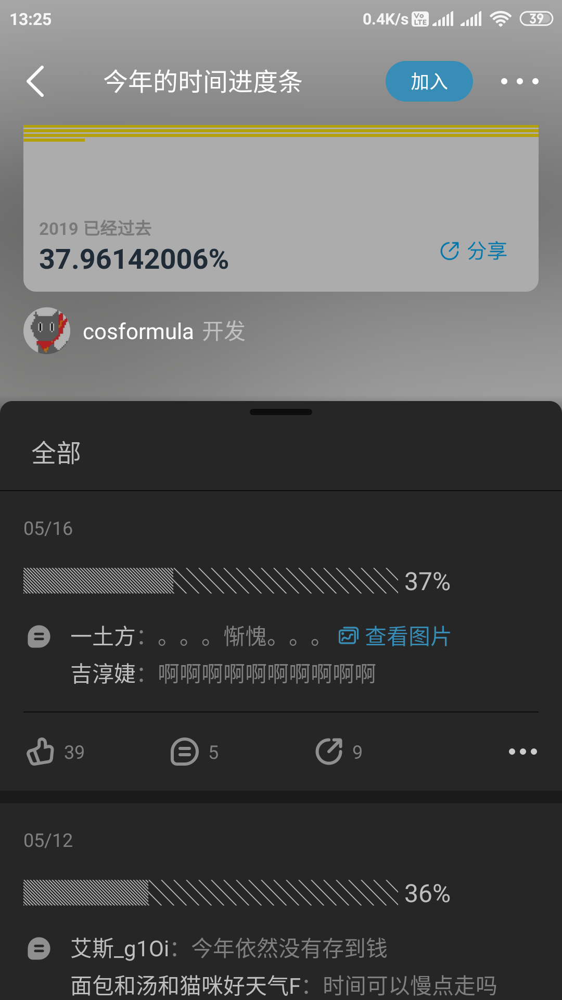
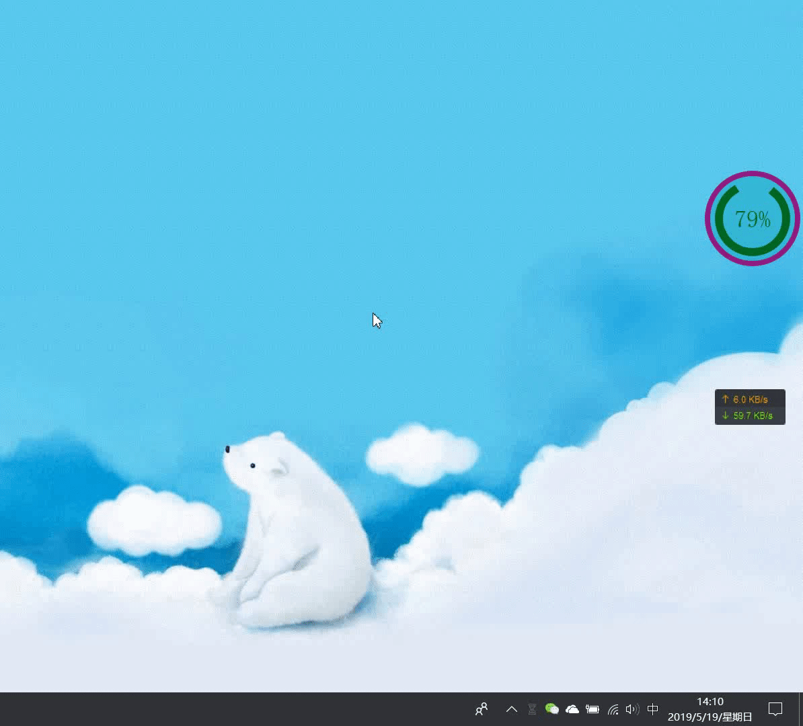
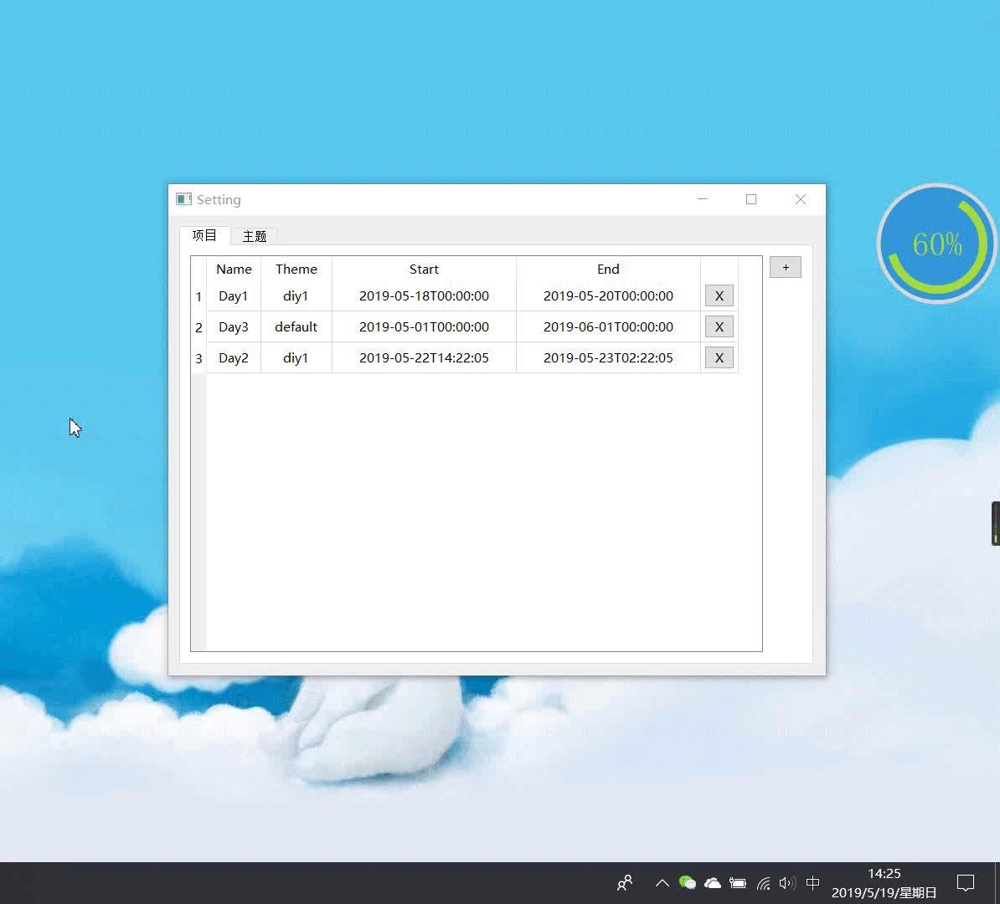

# TimeKiller  
*TimeKiller*这个词中文要怎么翻译，你们看着办，是这么个意思就行。^_^.

受*即刻App*中[*今年的时间进度条*](https://m.okjike.com/topics/5885f11ba4c2f200136c9552?source_username=cb740492-9c27-4c03-8f92-a8599ac45fe5)圈子动态的启发，想到我们可能更需要一款桌面端的时间进度条UI软件，这个软件能够实时的在桌面最前端长期停留并显示，以不断的提醒我们，自己规划的deadline还剩多少了，自己摸鱼又浪费了多长时间，是否需要996来挽救一下时间的流逝。^_^.

于是，这款软件就排上了我的空闲时间设计计划中。它需要有如下的功能和特性：

- 能直接停留在桌面上
- 在桌面上能随意移动位置
- 无边框
- 直观的进度条显示
- 可编辑的主题功能(包括边框、背景和线条)
- 可编辑和可添加的任务功能
- 多任务轮询显示功能

基于上面的需求，我设计了这一款软件，并且已经完成了上述的大部分功能，剩下的一下细节功能需要在后续迭代中实现。

该项目基于Qt5的UI框架实现，支持跨平台，理论上支持Windows、Linux和MacOs，受限于现有条件，MacOs端没有测试。
软件中，UI控件的绘制技巧参考了[*刘典武*](https://www.zhihu.com/people/feiyangqingyun/activities)的部分设计逻辑，在此表示感谢。

# 软件预览
## 即刻原动态  
  

## 本软件桌面显示效果

## 任务设置界面

## 主题编辑界面

# TODO  
- [ ] 主题颜色编辑功能
- [ ] 主题添加功能
- [ ] 主题移除功能
- [ ] 保持置顶选项
- [ ] 任务轮询周期设置
- [ ] 其他界面美化

